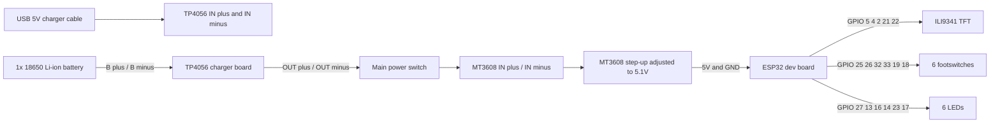
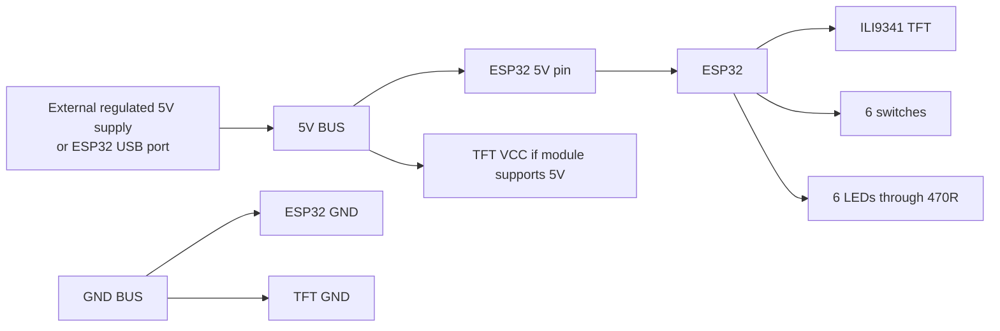
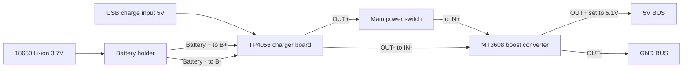
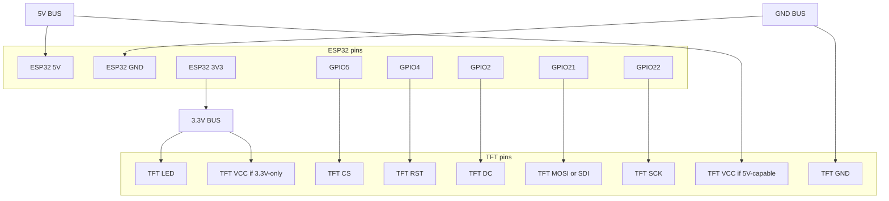
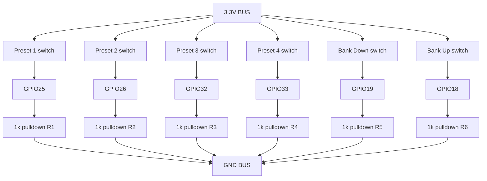
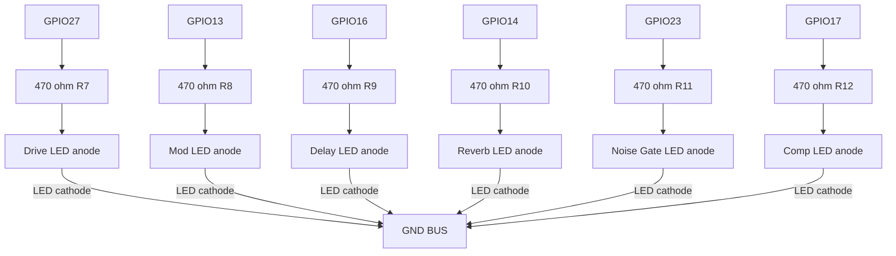

# ESP32-WROOM-32 (38-pin) to ILI9341 TFT Wiring Diagram

## Complete Hardware Plan For 94x53mm Stripboard

This setup assumes:

- 1x ESP32-WROOM-32 38-pin dev board
- 1x ILI9341 display
- 6x momentary footswitches
- 6x LEDs with 470 ohm resistors
- 6x switch pulldown resistors of 1k
- 1x TP4056 charger/protection board for a single 3.7V lithium cell
- 1x MT3608 boost converter adjusted to 5.1V
- 1x single 18650 lithium-ion battery

Important:

- The TP4056 charger is for one single-cell 3.7V lithium battery only.
- Do not use a 2S or 3S pack with this charger.
- Use a protected 18650 cell if possible.
- The MT3608 output must be adjusted before connecting it to the ESP32.
- Set the MT3608 to about 5.1V with a multimeter.

## Power Wiring

Power path:

1. Battery to TP4056 battery pads
2. TP4056 protected output to main power switch
3. Main power switch to MT3608 input
4. MT3608 output to ESP32 5V and GND

TP4056 typical pads:

- B+ -> battery positive
- B- -> battery negative
- OUT+ -> switched load positive
- OUT- -> load ground
- IN+ / IN- -> 5V charging input from USB connector on the TP4056 board

MT3608 typical pads:

- IN+ -> from TP4056 OUT+ through power switch
- IN- -> from TP4056 OUT-
- OUT+ -> ESP32 5V pin
- OUT- -> ESP32 GND

Recommended battery:

- 1x 18650 Li-ion, 3000 to 3500mAh
- Protected cell preferred
- Use a battery holder or spot-welded tabs, not loose wires directly on the cell

Note:

- This TP4056 plus MT3608 setup is fine for a simple battery pedal.
- It is not a proper power-path or UPS design.
- Best practice is to charge when the pedal is turned off.

## Full System Wiring Diagram



## Temporary 5V First, Battery Later

If you want to build and test before buying the battery, use this temporary wiring:



Later, remove the temporary 5V source and feed the same 5V bus from the MT3608 output.

## Recommended Board Strategy

Because the enclosure has the display, switches, USB-C opening and power parts spread around the shell, the cleanest build is:

- Main board: one 94x53mm stripboard for ESP32, TFT header, switch headers, LED resistors and LED headers
- Power board: one smaller cut piece for TP4056, MT3608 and the main power switch

This is easier to fit and easier to service than forcing everything onto one board.

Recommended split:

- Main board near the ESP32 and screen cable
- Small power board near the USB-C charge opening and battery holder

## Complete Component Diagram With Values

This version is split into smaller diagrams so you can build one section at a time without tracing a single crowded chart.



Power section only. Build this as its own small board if possible.



ESP32 and TFT only. Use either the 5V or the 3.3V VCC option for the TFT, not both.



Switch section only. Each switch has one wire to `3.3V BUS` and one wire to its GPIO. Each GPIO also gets its own `1k` resistor to `GND BUS`.



LED section only. Each LED output needs one `470 ohm` series resistor before the LED anode.

## TFT Wiring

| TFT Pin    | ESP32 GPIO | ESP32 38-pin Physical Pin |
|------------|------------|---------------------------|
| VCC        | 3.3V/5V    | 1 (3V3) or 2 (5V)         |
| GND        | GND        | 14, 38, or 1 (GND)        |
| CS         | GPIO5      | 29                        |
| RESET      | GPIO4      | 24                        |
| DC         | GPIO2      | 22                        |
| SDI(MOSI)  | GPIO21     | 33                        |
| SCK        | GPIO22     | 36                        |
| LED        | 3.3V       | 1 (3V3)                   |
| SDO(MISO)  | (NC)       | (not connected)           |

## Quick Wiring Cheat Sheet

Clean, solder-first overview in the same style as the TFT table.

### TFT (ILI9341)

| TFT Pin | Connect To | ESP32 38-pin Physical Pin |
|---------|------------|---------------------------|
| VCC | 3.3V or 5V (module dependent) | 1 (3V3) or 2 (5V) |
| GND | GND | 14, 38, or 1 (GND) |
| CS | GPIO5 | 29 |
| RESET | GPIO4 | 24 |
| DC | GPIO2 | 22 |
| SDI (MOSI) | GPIO21 | 33 |
| SCK | GPIO22 | 36 |
| LED | 3.3V | 1 (3V3) |
| SDO (MISO) | NC | not connected |

### Switches (6x)

| Switch | Connect Side A To | Connect Side B To |
|--------|-------------------|-------------------|
| Preset 1 | 3.3V | GPIO25 |
| Preset 2 | 3.3V | GPIO26 |
| Preset 3 | 3.3V | GPIO32 |
| Preset 4 | 3.3V | GPIO33 |
| Bank Down | 3.3V | GPIO19 |
| Bank Up | 3.3V | GPIO18 |

### Switch Pulldown Resistors (6x 1k)

| Resistor | From | To |
|----------|------|----|
| R1 | GPIO25 | GND |
| R2 | GPIO26 | GND |
| R3 | GPIO32 | GND |
| R4 | GPIO33 | GND |
| R5 | GPIO19 | GND |
| R6 | GPIO18 | GND |

### LEDs (6x, each with 470 ohm)

| LED | Signal Pin | `+` LED Pin (Anode) | `-` LED Pin (Cathode) |
|-----|------------|---------------------|-----------------------|
| Drive | GPIO27 | From GPIO27 through 470 ohm | To GND |
| Mod | GPIO13 | From GPIO13 through 470 ohm | To GND |
| Delay | GPIO16 | From GPIO16 through 470 ohm | To GND |
| Reverb | GPIO14 | From GPIO14 through 470 ohm | To GND |
| Noise Gate | GPIO23 | From GPIO23 through 470 ohm | To GND |
| Comp | GPIO17 | From GPIO17 through 470 ohm | To GND |

### Power Modules

| Module Pin | Connect To | Note |
|------------|------------|------|
| TP4056 B+ | Battery + | battery only |
| TP4056 B- | Battery - | battery only |
| TP4056 OUT+ | Main switch input | load output |
| TP4056 OUT- | MT3608 IN- | load ground |
| MT3608 IN+ | Main switch output | from TP4056 OUT+ through switch |
| MT3608 IN- | TP4056 OUT- | common ground path |
| MT3608 OUT+ | 5V BUS | adjust to 5.1V first |
| MT3608 OUT- | GND BUS | common ground |

### ESP32 Power Pins

| ESP32 Pin | Connect To |
|-----------|------------|
| 5V | 5V BUS |
| GND | GND BUS |
| 3V3 | 3.3V BUS |

Note: In this project, GPIO18 and GPIO23 are used by button/LED logic, so the TFT SPI bus is mapped to GPIO22 (SCK) and GPIO21 (MOSI).

Recommended display power wiring:

- First try TFT VCC to ESP32 5V only if your module explicitly supports 5V input
- If your module is a 3.3V-only type, use ESP32 3V3 instead
- TFT logic lines from the ESP32 are already 3.3V and are safe for the display
- TFT LED pin can go to 3.3V for a safer backlight level

## Switch Wiring

Each switch is wired the same way:

- One side of the switch to 3.3V
- The other side of the switch to the ESP32 GPIO input
- From that same GPIO input, connect a 1k resistor to GND

This makes the input normally LOW and HIGH when pressed.

| Function | ESP32 GPIO |
|----------|------------|
| Preset 1 / Drive | GPIO25 |
| Preset 2 / Mod | GPIO26 |
| Preset 3 / Delay | GPIO32 |
| Preset 4 / Reverb | GPIO33 |
| Bank Down / Noise Gate | GPIO19 |
| Bank Up / Comp | GPIO18 |

## LED Wiring

Each LED is wired the same way:

- ESP32 GPIO -> 470 ohm resistor -> LED anode
- LED cathode -> GND

LED leg identification:

- LED `+` pin = `anode` = usually the `long leg`
- LED `-` pin = `cathode` = usually the `short leg` and flat edge side
- The `470 ohm resistor` always goes in series with the `+` side (anode side)

Quick pattern for every LED:

- `GPIO -> 470R -> LED + (anode)`
- `LED - (cathode) -> GND BUS`

| LED Function | ESP32 GPIO |
|--------------|------------|
| Drive | GPIO27 |
| Mod | GPIO13 |
| Delay | GPIO16 |
| Reverb | GPIO14 |
| Noise Gate | GPIO23 |
| Comp | GPIO17 |

### LED Pin-by-Pin Map

| LED | `+` pin (anode) connection | `-` pin (cathode) connection |
|-----|----------------------------|-------------------------------|
| Drive LED | `GPIO27 -> 470R -> LED +` | `LED - -> GND BUS` |
| Mod LED | `GPIO13 -> 470R -> LED +` | `LED - -> GND BUS` |
| Delay LED | `GPIO16 -> 470R -> LED +` | `LED - -> GND BUS` |
| Reverb LED | `GPIO14 -> 470R -> LED +` | `LED - -> GND BUS` |
| Noise Gate LED | `GPIO23 -> 470R -> LED +` | `LED - -> GND BUS` |
| Comp LED | `GPIO17 -> 470R -> LED +` | `LED - -> GND BUS` |

### LED Mini Diagram

```text
GPIO pin ---- 470R ---- (+) LED (-) ---- GND BUS
```

## 94x53mm Stripboard Layout Suggestion

Use the stripboard with the copper rows running horizontally.

Suggested physical arrangement on the main 94x53 board:

- Top edge: TFT connector header
- Center: ESP32 on female headers
- Left side: six switch input headers
- Right side: six LED resistors and LED headers
- Bottom edge: 3V3, 5V and GND buses plus one power input header from the power board

Do not force TP4056 and MT3608 onto the same board unless you must. If needed, put them on a second small board and bring only `5V` and `GND` to the main board.

Simple placement sketch:

```text
Top edge of board 94mm

+--------------------------------------------------------------+
| TFT header: VCC GND CS RST DC MOSI SCK LED                  |
|                                                              |
| SW1 SW2 SW3 headers                        R1 R2 R3 LED1-3   |
| SW4 SW5 SW6 headers                        R4 R5 R6 LED4-6   |
|                                                              |
|                 ESP32 on 2x female headers                   |
|                                                              |
| GND bus row ----------------------------------------------   |
| 3V3 bus row ----------------------------------------------   |
| 5V bus row  ----------------------------------------------   |
| PWR IN header from power board: 5V / GND                    |
|                                                              |
+--------------------------------------------------------------+

Bottom edge of board 94mm
```

Suggested power daughterboard:

```text
Small cut stripboard for power section

+--------------------------------------+
| TP4056 charger board                 |
| B+ B- to battery holder              |
| OUT+ OUT- to power switch / boost    |
|                                      |
| Power switch                         |
|                                      |
| MT3608 boost module                  |
| IN+ IN- from TP4056 OUT              |
| OUT+ OUT- to main board 5V / GND     |
+--------------------------------------+
```

## Main Board Connection Blocks

Use headers or solder pads on the main board like this:

### Header J1: Power In From MT3608

- Pin 1: 5V
- Pin 2: GND

### Header J2: TFT Connector

- Pin 1: VCC
- Pin 2: GND
- Pin 3: CS -> GPIO5
- Pin 4: RST -> GPIO4
- Pin 5: DC -> GPIO2
- Pin 6: MOSI -> GPIO21
- Pin 7: SCK -> GPIO22
- Pin 8: LED -> 3.3V

### Header J3 to J8: Switch Headers

- J3 Preset 1: 3.3V and GPIO25
- J4 Preset 2: 3.3V and GPIO26
- J5 Preset 3: 3.3V and GPIO32
- J6 Preset 4: 3.3V and GPIO33
- J7 Bank Down: 3.3V and GPIO19
- J8 Bank Up: 3.3V and GPIO18

Each switch GPIO also gets its own 1k pulldown resistor to GND on the board.

### Header J9 to J14: LED Headers

- J9 Drive LED: GPIO27 through 470R, then LED, then GND
- J10 Mod LED: GPIO13 through 470R, then LED, then GND
- J11 Delay LED: GPIO16 through 470R, then LED, then GND
- J12 Reverb LED: GPIO14 through 470R, then LED, then GND
- J13 Noise Gate LED: GPIO23 through 470R, then LED, then GND
- J14 Comp LED: GPIO17 through 470R, then LED, then GND

## Readable Point-To-Point Wiring Table

| Part | Wire 1 | Wire 2 | Extra part in line |
|------|--------|--------|--------------------|
| Battery holder | TP4056 B+ | TP4056 B- | 1x 18650 cell |
| TP4056 output | Main switch input | TP4056 OUT- | none |
| Main switch output | MT3608 IN+ | none | switch in positive line only |
| MT3608 IN- | TP4056 OUT- | none | common ground |
| MT3608 OUT+ | Main board 5V bus | none | set to 5.1V first |
| MT3608 OUT- | Main board GND bus | none | common ground |
| TFT VCC | 3.3V or 5V | none | check module marking |
| TFT LED | 3.3V | none | safe default |
| TFT GND | GND | none | common ground |
| TFT CS | GPIO5 | none | direct wire |
| TFT RST | GPIO4 | none | direct wire |
| TFT DC | GPIO2 | none | direct wire |
| TFT MOSI | GPIO21 | none | direct wire |
| TFT SCK | GPIO22 | none | direct wire |
| Switch 1 | 3.3V | GPIO25 | 1k from GPIO25 to GND |
| Switch 2 | 3.3V | GPIO26 | 1k from GPIO26 to GND |
| Switch 3 | 3.3V | GPIO32 | 1k from GPIO32 to GND |
| Switch 4 | 3.3V | GPIO33 | 1k from GPIO33 to GND |
| Switch 5 | 3.3V | GPIO19 | 1k from GPIO19 to GND |
| Switch 6 | 3.3V | GPIO18 | 1k from GPIO18 to GND |
| Drive LED | GPIO27 | GND | 470R in series |
| Mod LED | GPIO13 | GND | 470R in series |
| Delay LED | GPIO16 | GND | 470R in series |
| Reverb LED | GPIO14 | GND | 470R in series |
| Noise Gate LED | GPIO23 | GND | 470R in series |
| Comp LED | GPIO17 | GND | 470R in series |

## Polarity And Pin Orientation (Important)

Use this section to avoid reversed wiring.

### LEDs (most important)

- `Anode` = LED `+` side = usually the `longer leg`
- `Cathode` = LED `-` side = usually the `shorter leg` and `flat side on LED body`
- In this project:
    - GPIO pin -> `470 ohm resistor` -> LED `anode (+)`
    - LED `cathode (-)` -> `GND BUS`

If an LED does not light, first check if anode/cathode is reversed.

### Resistors

- Resistors have `no polarity`
- `1k` switch pulldown resistors can be placed either direction
- `470 ohm` LED series resistors can be placed either direction

### Switches

- SPST momentary switches used here have `no polarity`
- One terminal goes to `3.3V BUS`
- The other terminal goes to the assigned `GPIO`

### Battery holder and battery

- Battery holder `+` must go to TP4056 `B+`
- Battery holder `-` must go to TP4056 `B-`
- Never swap battery polarity

### TP4056 board

- `B+` and `B-` are battery only
- `OUT+` and `OUT-` are load output only
- Do not connect the system load to `B+`/`B-`
- USB input on the TP4056 is the charger input only

### MT3608 board

- `IN+` from TP4056 `OUT+` through power switch
- `IN-` from TP4056 `OUT-`
- `OUT+` to main `5V BUS`
- `OUT-` to main `GND BUS`
- Adjust output to `5.1V` before connecting ESP32

### TFT module

- `GND` always to `GND BUS`
- `LED` backlight pin to `3.3V BUS` (safe default)
- `VCC` to `5V BUS` only if your TFT module supports 5V input
- If TFT is 3.3V-only, connect `VCC` to `3.3V BUS`

### ESP32 power pins

- Main supply in this design is through ESP32 `5V` and `GND`
- `3.3V` pin is used as output rail for switches and TFT LED
- Keep `GND BUS` common for all components

## Quick Polarity Table

| Component | Positive / signal side | Negative / return side |
|-----------|------------------------|-------------------------|
| Battery holder | `+` to TP4056 `B+` | `-` to TP4056 `B-` |
| TP4056 load output | `OUT+` to switch -> MT3608 `IN+` | `OUT-` to MT3608 `IN-` |
| MT3608 output | `OUT+` to `5V BUS` | `OUT-` to `GND BUS` |
| ESP32 supply | `5V` pin from `5V BUS` | `GND` pin to `GND BUS` |
| TFT supply | `VCC` to 5V or 3.3V (module dependent) | `GND` to `GND BUS` |
| TFT backlight | `LED` to `3.3V BUS` | internal return to TFT GND |
| Each switch | one side to `3.3V BUS` | other side to GPIO; GPIO also via `1k` to GND |
| Each LED | `anode (+)` from GPIO through `470 ohm` | `cathode (-)` to `GND BUS` |

## Exact Solder Wires

Use this as the literal solder checklist.

### Power section

1. Solder battery holder positive to TP4056 `B+`
2. Solder battery holder negative to TP4056 `B-`
3. Solder TP4056 `OUT+` to one lug of the main power switch
4. Solder the other lug of the main power switch to MT3608 `IN+`
5. Solder TP4056 `OUT-` to MT3608 `IN-`
6. Solder MT3608 `OUT+` to the main board `5V BUS`
7. Solder MT3608 `OUT-` to the main board `GND BUS`
8. If using temporary power first: solder external regulated `5V` to the same `5V BUS`, and external `GND` to the same `GND BUS`

### ESP32 power

9. Solder main board `5V BUS` to ESP32 `5V`
10. Solder main board `GND BUS` to one ESP32 `GND`
11. Solder ESP32 `3V3` to main board `3.3V BUS`

### TFT display

12. Solder TFT `CS` to ESP32 `GPIO5`
13. Solder TFT `RST` to ESP32 `GPIO4`
14. Solder TFT `DC` to ESP32 `GPIO2`
15. Solder TFT `MOSI` or `SDI` to ESP32 `GPIO21`
16. Solder TFT `SCK` to ESP32 `GPIO22`
17. Solder TFT `GND` to main board `GND BUS`
18. Solder TFT `LED` to main board `3.3V BUS`
19. Solder TFT `VCC` to main board `5V BUS` only if the TFT module supports `5V`; otherwise solder TFT `VCC` to `3.3V BUS`

### Switches

20. Solder one side of Preset 1 switch to `3.3V BUS`
21. Solder the other side of Preset 1 switch to ESP32 `GPIO25`
22. Solder one `1k` resistor from ESP32 `GPIO25` to `GND BUS`
23. Solder one side of Preset 2 switch to `3.3V BUS`
24. Solder the other side of Preset 2 switch to ESP32 `GPIO26`
25. Solder one `1k` resistor from ESP32 `GPIO26` to `GND BUS`
26. Solder one side of Preset 3 switch to `3.3V BUS`
27. Solder the other side of Preset 3 switch to ESP32 `GPIO32`
28. Solder one `1k` resistor from ESP32 `GPIO32` to `GND BUS`
29. Solder one side of Preset 4 switch to `3.3V BUS`
30. Solder the other side of Preset 4 switch to ESP32 `GPIO33`
31. Solder one `1k` resistor from ESP32 `GPIO33` to `GND BUS`
32. Solder one side of Bank Down switch to `3.3V BUS`
33. Solder the other side of Bank Down switch to ESP32 `GPIO19`
34. Solder one `1k` resistor from ESP32 `GPIO19` to `GND BUS`
35. Solder one side of Bank Up switch to `3.3V BUS`
36. Solder the other side of Bank Up switch to ESP32 `GPIO18`
37. Solder one `1k` resistor from ESP32 `GPIO18` to `GND BUS`

### LEDs

38. Solder ESP32 `GPIO27` to one side of a `470 ohm` resistor
39. Solder the other side of that resistor to the Drive LED anode
40. Solder the Drive LED cathode to `GND BUS`
41. Solder ESP32 `GPIO13` to one side of a `470 ohm` resistor
42. Solder the other side of that resistor to the Mod LED anode
43. Solder the Mod LED cathode to `GND BUS`
44. Solder ESP32 `GPIO16` to one side of a `470 ohm` resistor
45. Solder the other side of that resistor to the Delay LED anode
46. Solder the Delay LED cathode to `GND BUS`
47. Solder ESP32 `GPIO14` to one side of a `470 ohm` resistor
48. Solder the other side of that resistor to the Reverb LED anode
49. Solder the Reverb LED cathode to `GND BUS`
50. Solder ESP32 `GPIO23` to one side of a `470 ohm` resistor
51. Solder the other side of that resistor to the Noise Gate LED anode
52. Solder the Noise Gate LED cathode to `GND BUS`
53. Solder ESP32 `GPIO17` to one side of a `470 ohm` resistor
54. Solder the other side of that resistor to the Comp LED anode
55. Solder the Comp LED cathode to `GND BUS`

## Soldering Order

1. Put the ESP32 female headers in place first
2. Mark and cut copper tracks under the ESP32 pins so rows do not short together
3. Add the 3V3, 5V and GND bus rows
4. Add the TFT connector header
5. Add the six 1k switch pulldown resistors
6. Add the six 470 ohm LED resistors
7. Add the switch headers and LED headers
8. Test the main board first with temporary 5V power
9. Build the separate power daughterboard with TP4056, switch and MT3608
10. Adjust MT3608 output to 5.1V before connecting it to the main board
11. Connect the power daughterboard to the main board 5V and GND header

## Final Summary

- Build the logic first on the 94x53 main board
- Power it temporarily from 5V now
- Use 6x `1k` pulldown resistors for the switches
- Use 6x `470 ohm` series resistors for the LEDs
- Put TP4056 and MT3608 on a second small board if space gets tight
- Later feed the same 5V bus from the MT3608 output
